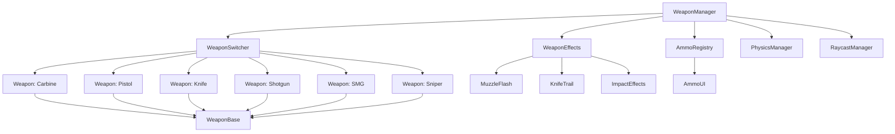

# Weapon System Design

## Overview

The weapon system is a comprehensive combat framework that manages six distinct weapons with unique characteristics, animations, and effects. The system integrates with the existing physics foundation, asset management, and game configuration to provide responsive and immersive combat mechanics.

The design follows a modular architecture with separate managers for weapons, ammunition, effects, and user interface components. This allows for easy extension and modification of weapon properties while maintaining consistent behavior across all weapon types.

## Architecture

### Core Components



### System Integration

The weapon system integrates with existing framework components:

- **PhysicsManager**: For collision detection and projectile physics
- **RaycastManager**: For hit detection and line-of-sight calculations
- **AssetManager**: For loading weapon models and animations
- **AudioManager**: For weapon sound effects
- **GameConfig**: For weapon statistics and configuration
- **InputManager**: For weapon switching and firing controls

## Components and Interfaces

### WeaponManager

The central coordinator for all weapon-related functionality.

```javascript
class WeaponManager {
    constructor(scene, player, physicsManager, raycastManager)
    
    // Core functionality
    initialize()
    update(deltaTime)
    dispose()
    
    // Weapon management
    equipWeapon(weaponType)
    switchToNextWeapon()
    switchToPreviousWeapon()
    
    // Combat actions
    fire()
    reload()
    
    // State queries
    getCurrentWeapon()
    getAmmoCount()
    canFire()
    isReloading()
}
```

### WeaponBase

Abstract base class for all weapons with common functionality.

```javascript
class WeaponBase {
    constructor(config, scene, effectsManager)
    
    // Weapon properties
    damage: number
    fireRate: number
    magazineSize: number
    reloadTime: number
    accuracy: number
    recoilPattern: RecoilPattern
    
    // Core methods
    fire(origin, direction)
    reload()
    update(deltaTime)
    
    // Animation control
    playReloadAnimation()
    pauseAtIdle()
    applyRecoil()
    
    // State management
    canFire()
    isReloading()
    getCurrentAmmo()
}
```

### Weapon Implementations

Each weapon extends WeaponBase with specific behavior:

#### Projectile Weapons (Carbine, Pistol, Shotgun, SMG, Sniper)
- Use raycast-based hit detection
- Apply damage through physics system
- Generate muzzle flash effects
- Manage ammunition and reloading

#### Melee Weapon (Knife)
- Use area-of-effect detection in front of player
- Generate trail effects during swing
- No ammunition management
- Longer attack animation duration

### WeaponEffects

Manages all visual effects for weapons.

```javascript
class WeaponEffects {
    constructor(scene)
    
    // Muzzle flash effects
    createMuzzleFlash(weapon, position, type) // 'spikey' or 'donut'
    
    // Knife trail effects
    createKnifeTrail(startPosition, endPosition)
    
    // Impact effects
    createImpactEffect(position, normal, material)
    
    // Effect cleanup
    updateEffects(deltaTime)
    disposeEffect(effectId)
}
```

### AmmoRegistry and UI

Tracks ammunition for all weapons and displays current status.

```javascript
class AmmoRegistry {
    constructor()
    
    // Ammo management
    setAmmo(weaponType, current, max)
    consumeAmmo(weaponType, amount)
    reloadWeapon(weaponType)
    
    // State queries
    getCurrentAmmo(weaponType)
    getMaxAmmo(weaponType)
    isEmpty(weaponType)
    isFull(weaponType)
}

class AmmoUI {
    constructor(scene)
    
    // UI updates
    updateDisplay(weaponType, current, max)
    showReloadIndicator()
    hideReloadIndicator()
    
    // Special cases
    showInfiniteAmmo() // For knife
    highlightLowAmmo()
}
```

## Data Models

### Weapon Configuration

```javascript
const WeaponConfigs = {
    carbine: {
        name: 'Carbine',
        type: 'semi-auto',
        damage: 50,
        fireRate: 0.15, // seconds between shots
        magazineSize: 12,
        reloadTime: 3.0,
        accuracy: 0.95,
        recoilAmount: 0.1,
        muzzleFlashType: 'donut',
        modelPath: './assets/weapons/carbine/fps_animated_carbine.glb'
    },
    
    pistol: {
        name: 'Pistol',
        type: 'semi-auto',
        damage: 20,
        fireRate: 0.12,
        magazineSize: 14,
        reloadTime: 3.0,
        accuracy: 0.90,
        recoilAmount: 0.08,
        muzzleFlashType: 'donut',
        modelPath: './assets/weapons/pistol/fps_animated_pistol.glb'
    },
    
    shotgun: {
        name: 'Shotgun',
        type: 'semi-auto',
        damage: 10, // per pellet
        pelletCount: 10,
        spreadAngle: 15, // degrees
        fireRate: 0.8,
        magazineSize: 4,
        reloadTime: 3.0,
        accuracy: 0.85,
        recoilAmount: 0.25,
        muzzleFlashType: 'donut',
        modelPath: './assets/weapons/shotgun/fps_animated_shotgun.glb'
    },
    
    smg: {
        name: 'SMG',
        type: 'full-auto',
        damage: 25,
        fireRate: 0.08,
        magazineSize: 23,
        reloadTime: 3.0,
        accuracy: 0.80,
        recoilAmount: 0.12,
        muzzleFlashType: 'spikey',
        modelPath: './assets/weapons/smg/fps_animated_smg.glb'
    },
    
    sniper: {
        name: 'Sniper',
        type: 'semi-auto',
        damage: 100,
        fireRate: 1.2,
        magazineSize: 5,
        reloadTime: 3.0,
        accuracy: 0.98,
        recoilAmount: 0.3,
        muzzleFlashType: 'donut',
        modelPath: './assets/weapons/sniper/fps_animated_sniper.glb'
    },
    
    knife: {
        name: 'Knife',
        type: 'melee',
        damage: 50,
        fireRate: 0.5, // swing cooldown
        magazineSize: Infinity,
        reloadTime: 0,
        accuracy: 1.0,
        range: 2.0, // meters
        swingAngle: 60, // degrees
        animationDuration: 4.83,
        modelPath: './assets/weapons/knife/fps_animated_knife.glb'
    }
};
```

### Accuracy System

```javascript
class AccuracySystem {
    constructor() {
        this.baseAccuracy = 1.0;
        this.movementPenalty = 0.0;
        this.recoilAccumulation = 0.0;
        this.recoveryRate = 2.0; // per second
    }
    
    // Factors affecting accuracy
    updateMovementPenalty(velocity) {
        const speed = velocity.length();
        this.movementPenalty = Math.min(speed * 0.1, 0.4);
    }
    
    addRecoil(amount) {
        this.recoilAccumulation = Math.min(
            this.recoilAccumulation + amount, 
            0.6
        );
    }
    
    getCurrentAccuracy(weaponBaseAccuracy) {
        return weaponBaseAccuracy * 
               (1.0 - this.movementPenalty) * 
               (1.0 - this.recoilAccumulation);
    }
}
```

## Error Handling

### Weapon Loading Errors
- Graceful fallback to default weapon if model fails to load
- Error logging with specific weapon identification
- Retry mechanism for network-related loading failures

### Animation Errors
- Default to static pose if animation fails to load
- Separate error handling for reload vs idle animations
- Fallback timing for animation-dependent actions

### Physics Integration Errors
- Fallback to basic collision detection if physics system unavailable
- Error recovery for raycast failures
- Graceful degradation of hit detection accuracy

### Audio/Visual Effects Errors
- Silent failure for missing sound effects
- Simplified visual effects if particle system fails
- Performance-based effect quality reduction

## Testing Strategy

### Unit Tests

1. **Weapon Configuration Tests**
   - Validate all weapon configs have required properties
   - Test damage calculations for each weapon type
   - Verify fire rate timing accuracy

2. **Ammunition System Tests**
   - Test ammo consumption and reload mechanics
   - Verify magazine capacity limits
   - Test infinite ammo for knife

3. **Accuracy System Tests**
   - Test movement penalty calculations
   - Verify recoil accumulation and recovery
   - Test accuracy bounds (0.0 to 1.0)

### Integration Tests

1. **Physics Integration Tests**
   - Test raycast hit detection for all weapons
   - Verify shotgun multi-pellet behavior
   - Test knife melee range detection

2. **Animation Integration Tests**
   - Test reload animation timing
   - Verify idle pose positioning
   - Test knife swing animation

3. **Effects Integration Tests**
   - Test muzzle flash attachment to weapons
   - Verify knife trail generation
   - Test effect cleanup and performance

### Performance Tests

1. **Rapid Fire Tests**
   - Test SMG full-auto performance
   - Verify effect pooling efficiency
   - Test memory usage during extended combat

2. **Multi-Weapon Tests**
   - Test weapon switching performance
   - Verify asset loading/unloading
   - Test simultaneous effect rendering

### User Experience Tests

1. **Weapon Feel Tests**
   - Verify weapon responsiveness
   - Test recoil visual feedback
   - Validate audio-visual synchronization

2. **UI/UX Tests**
   - Test ammo display accuracy
   - Verify reload indicator timing
   - Test weapon switching feedback

## Performance Considerations

### Asset Management
- Lazy loading of weapon models
- Shared animation systems where possible
- Texture atlas optimization for effects

### Effect Optimization
- Object pooling for muzzle flashes and trails
- LOD system for distant effects
- Automatic cleanup of expired effects

### Physics Optimization
- Raycast pooling through RaycastManager
- Collision layer optimization
- Spatial partitioning for melee detection

### Memory Management
- Proper disposal of weapon resources
- Animation memory cleanup
- Effect texture memory management

This design provides a robust foundation for the weapon system while maintaining flexibility for future enhancements and modifications.